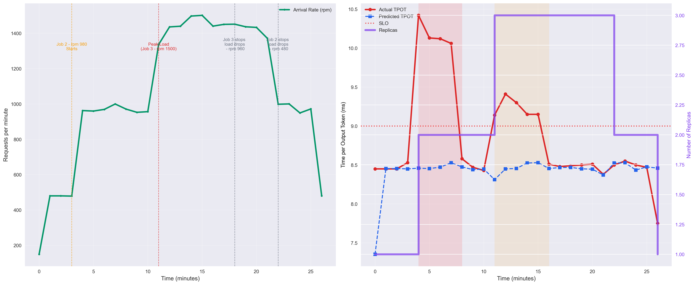

# vllm with wva autoscaler


Notes: 
1. Experiments on OpenShift Cluster with H100 GPUs.
2. To setup `vLLM` on `Openshift`, refer to [vllm-samples.md](vllm-samples.md).
3. We use `guidellm` as the load generator. Refer to [guidellm-sample.md](guidellm-sample.md) for a quick tutorial to create your guidellm image that will be used in a `Job` resource. 
3. The WVA autoscaler is assumed to be deployed in `inferno-autoscaler-system` namespace.


## Deploy configmaps and VA object
Create accelerator configmap (`oc apply -f configmap-accelerator-unitcost.yaml`):
```yaml
# configmap-accelerator-unitcost.yaml
apiVersion: v1
kind: ConfigMap
metadata:
  name: accelerator-unit-costs
  namespace: inferno-autoscaler-system
data:
  A100: |
    {
    "device": "NVIDIA-A100-PCIE-80GB",
    "cost": "40.00"
    }
  MI300X: |
    {
    "device": "AMD-MI300X-192GB",
    "cost": "65.00"
    }
  G2: |
    {
    "device": "Intel-Gaudi-2-96GB",
    "cost": "23.00"
    }
  H100: |
    {
    "device": "NVIDIA-H100-80GB-HBM3",
    "cost": "100.0"
    } 
```

Create service class config map `oc apply -f configmap-serviceclass.yaml`
```yaml
apiVersion: v1
kind: ConfigMap
metadata:
  name: service-classes-config
  namespace: inferno-autoscaler-system
data:
  premium.yaml: |
    name: Premium
    priority: 1
    data:
      - model: default/default
        slo-tpot: 24
        slo-ttft: 500
      - model: llama0-70b
        slo-tpot: 80
        slo-ttft: 500
      - model: unsloth/Meta-Llama-3.1-8B
        slo-tpot: 9
        slo-ttft: 1000
  freemium.yaml: |
    name: Freemium
    priority: 10
    data:
      - model: granite-13b
        slo-tpot: 200
        slo-ttft: 2000
      - model: llama0-7b
        slo-tpot: 150
        slo-ttft: 1500
```
Create **VariantAutoscaling Object** to manage the `vllm` deployment: `oc apply -f vllm-va.yaml`.
```yaml
# vllm-va.yaml
apiVersion: llmd.ai/v1alpha1
kind: VariantAutoscaling
metadata:
  name: vllm
  namespace: vllm-test
  labels:
    inference.optimization/modelName: Meta-Llama-3.1-8B
    inference.optimization/acceleratorName: H100
spec:
  modelID: unsloth/Meta-Llama-3.1-8B
  sloClassRef:
    name: premium-slo
    key: opt-125m
  modelProfile:
    accelerators:
      - acc: "H100"
        accCount: 1
        alpha: "6.958"
        beta: "0.042"
        maxBatchSize: 512 
```


## Load generation

### Create Jobs
Create three jobs `guidellm-job-1.yaml`, `guidellm-job-2.yaml` and `guidellm-job-3.yaml` based on the following template using the image created in step 1.
```yaml
apiVersion: batch/v1
kind: Job
metadata:
  name: guidellm-job
  namespace: vllm-test
spec:
  template:
    spec:
      containers:
      - name: guidellm-benchmark-container
        image: <image-repo>:<tag>
        imagePullPolicy: IfNotPresent
        env:
        - name: HF_HOME
          value: "/tmp"
        command: ["/usr/local/bin/guidellm"]
        args:
        - "benchmark"
        - "--target"
        - "http://vllm:8000"
        - "--rate-type"
        - "constant"
        - "--rate"
        - "<rate>"
        - "--max-seconds"
        - "<max-seconds>"
        - "--model"
        - "unsloth/Meta-Llama-3.1-8B"
        - "--data"
        - "prompt_tokens=128,output_tokens=512"
        - "--output-path"
        - "/tmp/benchmarks.json" 
      restartPolicy: Never
  backoffLimit: 4
```

In each job, fill in `image: <image-repo>:<tag>` with your `guidellm` image repo and tag. The `<rate>` and `max-seconds` are set as follows.

- In `guidellm-job-1.yaml`, we set `<rate>` and `<max-seconds>` to `8` and `1800` respectively. By doing this, we force `guidellm` client to send requests at rate `8` requests per second (480 req/min) for `30` minutes. 
- In `guidellm-job-2.yaml`, we set `<rate>` and `<max-seconds>` to  `8` and `1200` respectively. We start this job after a couple of minutes of starting `guidellm-job-1`. When both jobs are running, we are effectively sending requests at rate `8+8 = 16` requests per second (960 req/min).
- In `guidellm-job-3.yaml`, we set `<rate>` and `<max-seconds>` to `8` and `720` respectively. We start this job after a couple of minutes of starting `guidellm-job-2`. When all the three jobs are running, we are effectively sending requests at rate `8+8+8 = 24` requests per second (1440 req/min) for 12 minutes.
- With this setup, `guidellm-job-3` will complete first, bringing the effective request rate back to `16` req/sec. This is followed by the completion of `guidellm-job-2`, which will bring down rate to `8` req/sec. Finally, `guidellm-job-1` completes, after which no further requests are sent.

**Dynamic Load Generation Summary:** 
- Step 1: `oc apply -f guidellm-job-1.yaml`. Wait about 5 minutes before continuing to step 2.
- Step 2: `oc apply -f guidellm-job-2.yaml`. Wait about 5 minutes before continuing to step 3.
- Step 3: `oc apply -f guidellm-job-3.yaml`


## WVA Performance
The following figure shows the behaviour observed from the controller logs.




